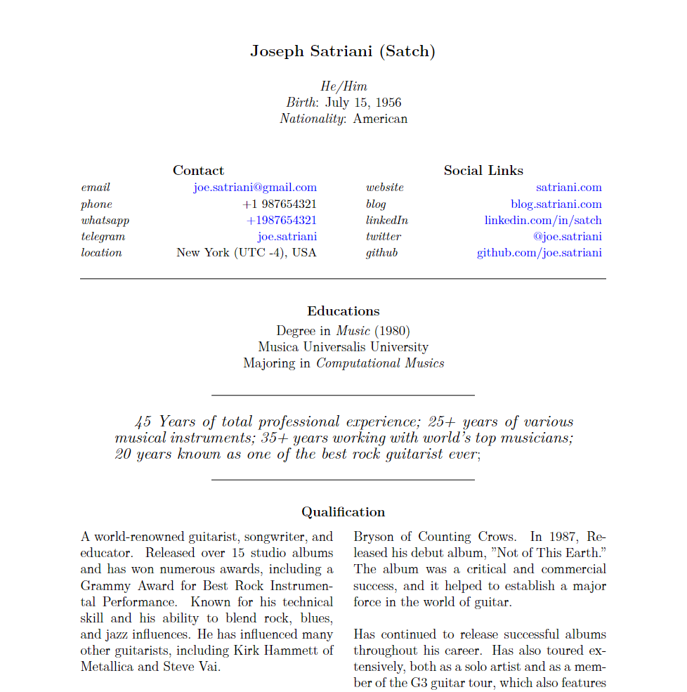

# excvtor
***Ex***tremely simple ***CV*** genera***Tor***

## About
This is a really simple python script that read resume data (JSON, yes, you need to make a json version of yours)
pair them with a template and from the both, produce LaTeX file and then compile it to PDF.
Here is what it look like:

[](out/satriani.pdf)

> **Disclaimer**: The above is not meant to display/distribute Mr. Joe Satriani personal/professional information and subject to be example only. All those information are available on the internet and some of them I just made it up.

## Setup
### What OS
Currently just tested on my Archlinux system (native, LXD and WSL). However since Python and Tectonic also available in multiple platform, you should be able to use it in your platform with no or just little modification.
### Requirements
- Python 3
- pip
- Tectonic
### Steps
- clone this repo and cd into the dir:
```
git clone https://github.com/aprksy/excvtor
cd excvtor
```
- if you prefer to use virtual env, create `myenv` and activate
```
python -m venv myenv
source myenv/bin/activate
```
- install required packages:
```
pip install pyyaml semver
```
- your now ready, see next section.

## How to 
- To show help:
```
./academic-base.py -h
```
- To render the resume using data `satriani.json`, using `academic` template:
```
./academic-base.py -t academic.yaml -r satriani.json -o satriani
```
The above command will: 
1. use the `satriani.json` as data file (you need to provide the complete path if it's not in the same dir with the script)
2. use the `templates/academic.yaml` as the template. Template files always in this directory.
3. if everything is okay, output a TeX file `out/satriani.tex` as the source code.
4. execute `tectonic out/satriani.tex --outfmt=pdf`
5. if everything is okay, output a pdf file `out/satriani.pdf`

## FAQ
<details>
    <summary>It seems the generator scripts is tightly coupled with the template, why?</summary>
    
    Yes, it's because between one template to another can be vary a lot. Developing a single generator to accomodate all the templates will make it extremely complicated. And this will violate this project title.

    However, a generator script can pick from multiple template files in the same family. Two template files is said to be from a same family if they have same layout and/or same sequence of TeX source code. More on this later.
</details>
<details>
    <summary>I tried to compile the generated TeX file using tectonic, and it shown a lot of warning message, what happened?</summary>
    
    Correct! That's because I'm not a competent TeX typesetter. I need a lot of help here.
</details>
<details>
    <summary>Why only one template file?</summary>
    
    Currently I develop this only for my CV because, I need to look for a new job. I will add some later on. Still looking for some idea.
</details>

## Creadits
- Python
- Tectonic typesettings
- All the TeX family
- res.cls class by Michael DeCorte